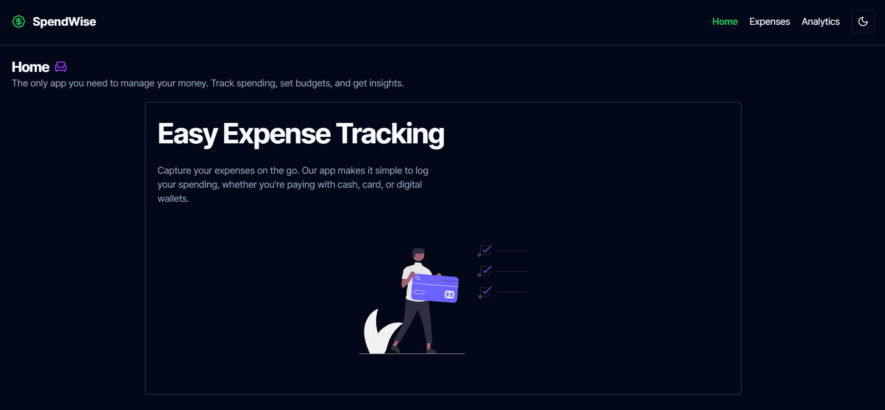
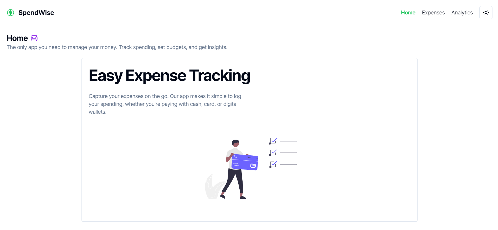
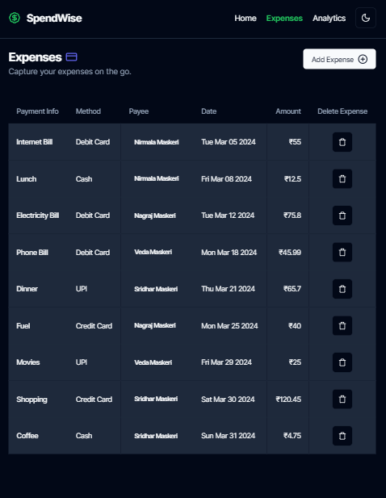
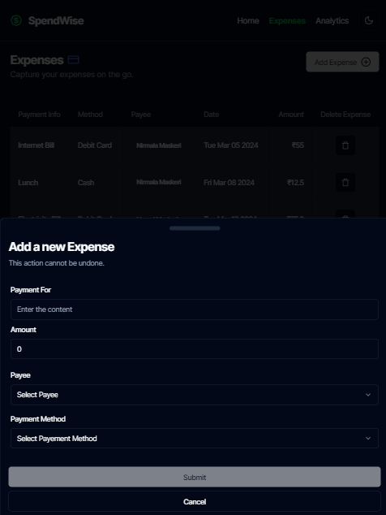
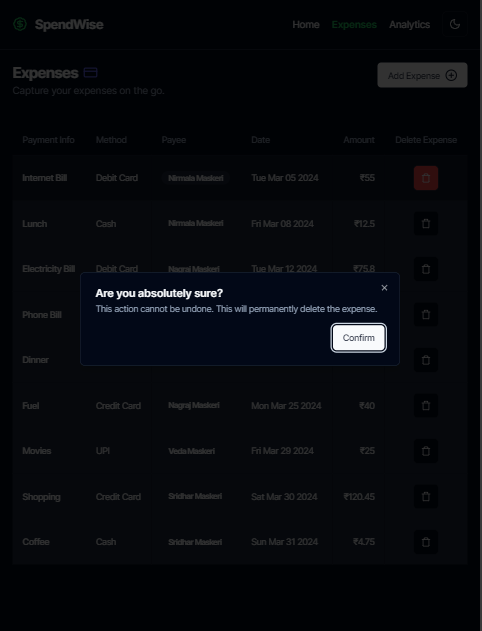
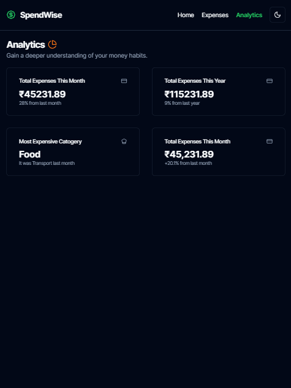

# SpendWise 💸

Check out the live app [here](https://spend-wise-three.vercel.app/)!





## Description ℹ️

Expense Tracker App is a personalized expense tracking application built using React with TypeScript, Shadcn UI and Tailwind CSS for styling. It provides a clean and intuitive interface to track expenses efficiently.

## Features ✨

- **Mobile Responsive** 📱: Ensures a seamless experience across devices of all sizes.
- **Light Mode/Dark Mode Toggle** 🌞🌚: Easily switch between light and dark themes for comfortable usage.
- **Mock API and Actual API Service Handlers** 🚀: Utilizes a single service that can switch between mock API and actual API service, facilitating development and testing.
- **Spinning Loaders and Skeleton Loading Effects** 💫: Enhances user experience with visually appealing loading indicators.
- **Toast Notifications** 🍞: Provides informative and non-intrusive notifications for user interactions.

## Screenshots 🖼️

### Expense List



### Add Expense Form



### Delete Expense Modal



### Expense Analytics



## Installation 🛠️

1. Clone the repository:
   ```bash
   git clone https://github.com/floating-dynamo/SpendWise.git
   ```

2. Navigate to the project directory:
   ```bash
   cd SpendWise
   ```

3. Install dependencies:
   ```bash
   npm install
   ```

## Usage 🚀
1. Start the development server:
   ```bash
   npm run dev
   ```

2. Open your browser and visit `http://localhost:5173/` to view the app.